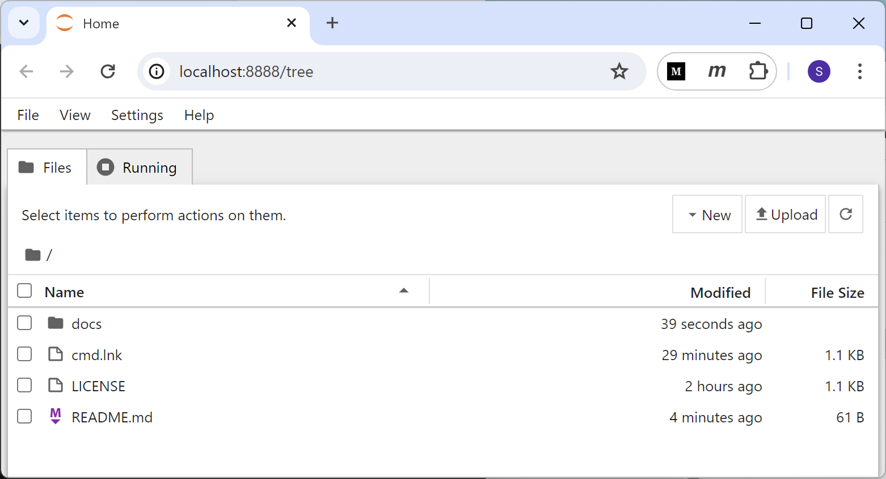

# docs
early documentation for this repository


## notes
+ Repository local folder is on `M:\`
+ Virtual environment `randp` is on `V:\`


## virtual environment
+ Download [`requirements.txt`](requirements.txt) to `V:\`
+ Open cmd
  ```
  V:\>
  ```
+ Create virtual enviroment
  ```
  V:\>py -m venv randp
  ```
+ Activate virtual enviroment
  ```
  V:\>randp/Script/activate
  ```
+ Install all packages
  ```
  (randp) V:\>pip install -r requirements.txt
  ```
+ Deactivate virtual environment
  ```
  (randp) V:\>deactivate
  ```
+ Close cmd
  ```
  V:\>exit
  ```
+ See [`venv.md`](venv.md) for more details, if necessary


## clone repository
+ Use GitBash or [install it first](https://medium.com/p/8d4c29799185).
  ```
  viridi@ryzen7 MINGW64 /m
  $ git clone https://github.com/dudung/random-problem
  Cloning into 'random-problem'...
  remote: Enumerating objects: 40, done.
  remote: Counting objects: 100% (40/40), done.
  remote: Compressing objects: 100% (33/33), done.
  remote: Total 40 (delta 14), reused 30 (delta 6), pack-reused 0
  Receiving objects: 100% (40/40), 188.66 KiB | 1.32 MiB/s, done.
  Resolving deltas: 100% (14/14), done.
  ```
+ Change directory
  ```
  viridi@ryzen7 MINGW64 /m
  $ cd random-problem
  ```
+ List all files
  ```
  viridi@ryzen7 MINGW64 /m
  $ ls -l
  total 5
  -rw-r--r-- 1 Sparisoma Viridi 197121 1094 May 25 11:36 LICENSE
  -rw-r--r-- 1 Sparisoma Viridi 197121  115 May 25 11:36 README.md
  drwxr-xr-x 1 Sparisoma Viridi 197121    0 May 25 11:36 docs/
  
  viridi@ryzen7 MINGW64 /m
  $ ls docs -l
  total 240
  -rw-r--r-- 1 Sparisoma Viridi 197121   2230 May 25 11:36 README.md
  -rw-r--r-- 1 Sparisoma Viridi 197121  80768 May 25 11:36 jupyter_notebook.png
  -rw-r--r-- 1 Sparisoma Viridi 197121   2148 May 25 11:36 requirements.txt
  -rw-r--r-- 1 Sparisoma Viridi 197121 153213 May 25 11:36 venv.md
  ```
+ Close GitBash
  ```
  viridi@ryzen7 MINGW64 /m
  $ exit
  ```

## jupyter notebook
+ Open `random-problem folder` on `M:\`
+ Open cmd
  ```
  M:\random-problem>
  ```
+ Activate virtual enviroment
  ```
  M:\random-problem>v:\randp\Scripts\activate
  ```
+ Run Jupyter Notebook
  ```
  (randp) M:\random-problem>jupyter notebook
  ```
+ Work on Jupyter opened Notebook window
  
+ Terminate Jupyter Notebook with CTRL+C on the cmd
  ```
  (randp) M:\random-problem>
  ```
+ Deactivate virtual environment
  ```
  (randp) M:\random-problem>deactivate
  ```
+ Close cmd
  ```
  M:\random-problem>exit
  ```
